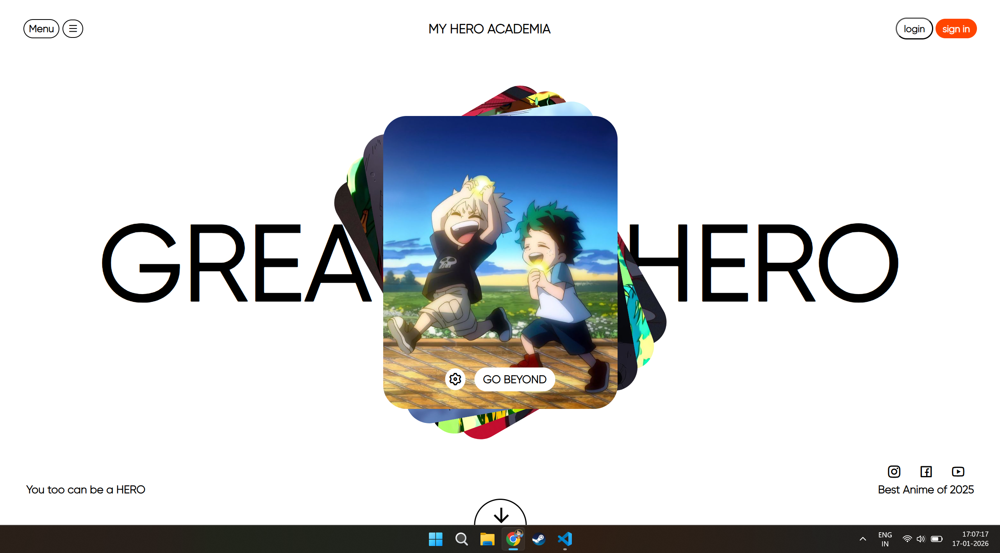

# My Hero Academia Landing Page

A clean and minimal static landing page inspired by *My Hero Academia*.  
Designed to practice layout, typography, and modern UI composition.

## 🌟 Features
- Minimal anime-inspired UI
- Center-focused hero card layout
- Clean typography and spacing
- Fully static and lightweight

## 🛠 Tech Stack
- HTML
- CSS

  

## 🚀 Live Demo
https://vedantthorat24.github.io/my-hero-academia-landing-page/
---

⚠️ This project is a fan-made UI concept and is not affiliated with or endorsed by the original creators of My Hero Academia.
